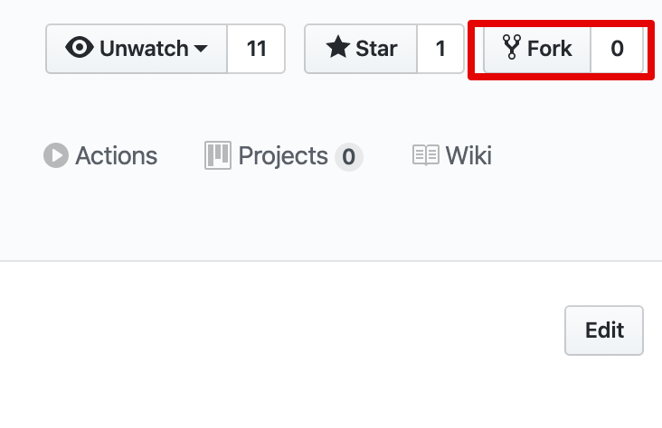
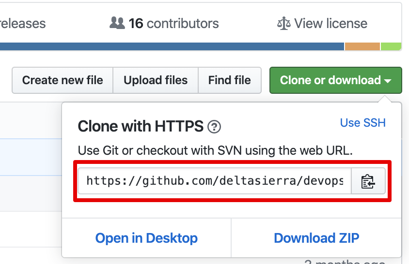
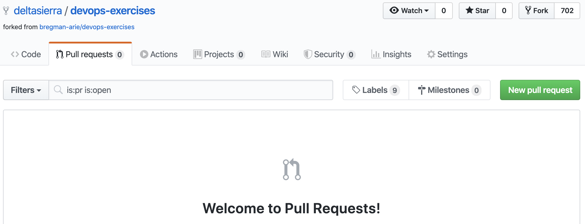

# Version-Control-Notes
# TL:DR

```
Fork the Repo 
git clone that-https-url-you-copied
git checkout -b jsmith-some-great-idea
// Make Changes // 
git add
git commit -m
git push origin jsmith-some-great-idea
// Open a PR // 
```

# Detailed Info 

Choose a project and issue to work on, there are plenty.  

1. Fork the Repo (make a copy) 


1. Clone the Repo (download the copy)

Navigate to the folder where you want to save the repository. On a Linux/Mac, ls will list the contents of the folder you’re in. `cd` foldername will open up a folder you saw in the list. `cd ..` will take you up one level. `mkdir` foldername will create a new folder.


Once you are inside the right folder, type 

```
git clone that-https-url-you-copied
```

3. Create a new local feature branch.
```
git checkout -b jsmith-some-great-idea
```
Name your branch following the branch naming convention, e.g.

`username-description`

4. Edit files in your local repo.

Use your favorite editor.  You can also add new files.

If you need to remove files

```
git rm
```

5. Stage the changes for a commit.

```
git add
```

You can add everything that you have changed (not including new files):

```
git add -u
```

You can add everything that you have changed (including new files):
```
git add .
```

You can be selective about which changes you want to stage, leaving others for a subsequent commit.
```
git add -p
```

6. Commit the changes to your local repo.

```
git commit
```

You can amend the previous commit.
```
git commit --amend
```

7. Push the branch 

When you are ready to share, or if you want to make an off-site backup of your changes, push them to GitHub, BitBucket, etc.  This will create a branch with the same name and will link your local branch to it for subsequent pushes/pulls.

```
git push -u origin HEAD
```

Make more changes (optional)

You can continue to edit files and make commits locally.

```
git add …
git commit
```

When you want to push them back, you can just do this (from your feature branch):
```
git push
```

8.  Open a PR

If you go to your repository on GitHub, you'll see a Compare & pull request button. Click on that button.

This is where you let the community know I’ve made some changes and would like to add them to the project? 

If the repository owner or members like what they see, they’ll merge it. Otherwise, they could make changes then merge or request for changes.



## Update your Fork 

How to get changes into your fork so that you’re working off the latest info in the original Master repo?  This is used when there has been some period of time that has lapsed and there are differences from your local and the remote project. 
```
git checkout master
git remote add upstream the-clone-https-url
git pull upstream master
git push origin master
```

# Optional Things

## Incorporate changes from the integration branch 

If you wish to incorporate changes from the integration branch into your topic branch, there are a few options.  The safest of these options is to create a new branch with a version suffix, e.g. “-v1”, and then to rebase this new branch onto the latest version of the integration branch.

Get the latest version of the repo but don’t update your local branch pointers.  This can be done from any branch.

```
git fetch
```

Create a new “version” of your topic branch (which is actually a new branch) by appending the version suffix, e.g. "-v1".  From your current topic branch:
```
git checkout -b jsmith-some-great-idea-v1
```

Rebase this new branch onto the integration branch, which is “develop” in this example.

```
git rebase origin/develop
```

If you want to preview the set of commits that will be rebased, you can use the interactive mode (-i).
```
git rebase -i origin/develop
```

Sometimes, Git will be unable to determine the proper set of commits, and you will be forced to specify the offset commit explicitly.
```
git rebase -i --onto origin/develop 6a4ef20
```

Any conflicts should be resolved during the rebase.  If it goes smoothly, you should discard both local and remote copies of your topic branch.
```
git branch -D jsmith-some-great-idea
git push origin :jsmith-some-great-idea
```

## Collaborate with a teammate on a topic branch.

Sometimes, you may want to collaborate with a teammate on a topic branch.  Each of you may be making changes to the topic branch, either directly or via spur branches that will be merged into the topic branch.  In that case, to get the latest version of the topic branch, just do this (from the topic branch):
```
git pull
```

1. Request a code review (as a requestor).After pushing all of your changes, visit the branch page to create a pull request (PR) with the button that should appear on the page.

2. Review the code (as a reviewer).When a code review is requested, please communicate with the requestor if you are unable to attend to the code review in a timely fashion.

If you have suggestions that require changes, often those changes will be fixups or other tweaks that will require a rebase by the requestor.  The convention is to finish iterating on the PR and then to have a single rebase and a final PR that incorporates all of the changes.

Rebase to organize the final topic branch (optional, as a requestor).If you have to make changes to satisfy the reviewer, and if those changes should be consolidated into new commits, then you may need to rebase.  

The interactive rebase is your friend.

1. First, make a new version of your topic branch.
```
git checkout -b jsmith-some-great-idea-v2
```

Next, invoke the interactive rebase.
```
git rebase -i
```

If you have used the shorthand rebase indicators, you can use the `autosquash` feature.
```
git rebase -i --autosquash
```

Approve the PR (as a reviewer).  Just push the button on the page to approve.

After the PR is merged, you can get the latest version of the integration branch, in this case, develop.
```
git checkout develop
git pull
```

Git may not remove your copy of the remote branch pointer.  You can force it like this:
```
git remote prune origin
```

Remove your local branches. Git will not remove your local branches.  After they are merged, however, you can safely remove them.
```
git branch -d jsmith-some-great-idea-v2
```

# Useful Commands when you mess up or need to remove, undo, etc. 

https://www.datree.io/resources/git-commands
